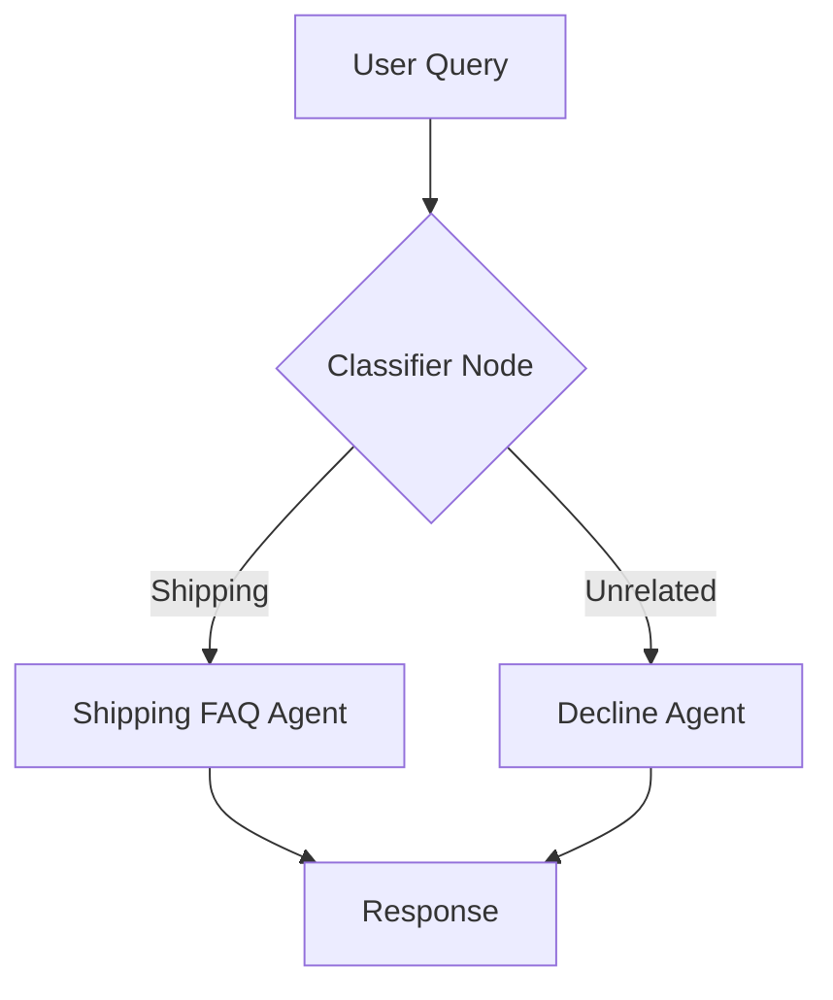

# Customer Support Agent (ADK 2.2.0)

[](https://www.python.org/)
[](https://cloud.google.com/agents)
[](https://ai.google.dev/)

A professional-grade, graph-based AI customer support agent built with the Google Agent Development Kit (ADK) 2.2.0.

## Table of Contents
- [Project Overview](#project-overview)
- [Workflow Architecture](#workflow-architecture)
- [Components](#components)
- [Technology Stack](#technology-stack)
- [Lessons Learned](#lessons-learned)
- [Setup Instructions](#setup-instructions)
- [Usage](#usage)
- [Sample Queries](#sample-queries)
- [Future Improvements](#future-improvements)

---

## Project Overview
This project demonstrates an intelligent, graph-based AI agent designed for shipping customer support. It classifies user queries, routes them to appropriate handlers, and maintains a polite, professional persona while filtering unrelated requests.

## Workflow Architecture
The agent uses a structured graph-based workflow.



## Components
1.  **Classifier Node**: Uses a Gemini model to analyze the user's intent and classify the query as `shipping` or `unrelated`.
2.  **Shipping FAQ Agent**: Provides relevant shipping information for shipping-related queries.
3.  **Decline Node**: Politely informs the user that the agent can only assist with shipping-related queries.

## Technology Stack
*   **Python 3.10+**
*   **Google ADK 2.2.0**
*   **Gemini**
*   **Agents CLI**

## Lessons Learned: Debugging ADK 2.2.0
- **Signature Verification**: API signatures for `FunctionNode` and `Edge` were stricter than documentation suggested.
- **Workflow Constraints**: The `Workflow` constructor does not support the `initial_node` argument in this version.
- **API Exploration**: I learned to inspect package source code directly (using `inspect` and `dir`) to verify constructor signatures rather than relying on inferred knowledge.

## Setup Instructions

### Prerequisites
- [uv](https://github.com/astral-sh/uv) (for dependency management)
- Google Cloud Project (with billing enabled)

### Installation
1. Clone the repository: `git clone https://github.com/Anushiv7/customer-support-agent`
2. Install dependencies: `agents-cli install`

## Usage
Run the agent in the local playground:
```bash
agents-cli playground
```

## Sample Queries
*   **Query**: "How can I track my package?"
    *   **Expected Output**: Shipping FAQ response.
*   **Query**: "What is the capital of France?"
    *   **Expected Output**: Polite decline message.

## Future Improvements
*   Integrate a real shipping API (e.g., FedEx or UPS tracking API).
*   Add persistent session storage using Cloud SQL.
*   Expand the FAQ node into a RAG (Retrieval-Augmented Generation) agent.

---
*Created as part of the Google × Kaggle AI Agents program.*
